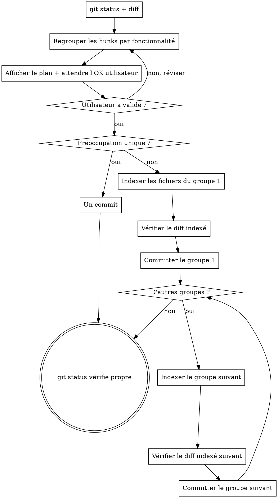

# Déroulé de git-commit

```dot
digraph commit_flow {
    "git status + diff" [shape=box];
    "Regrouper les hunks par fonctionnalité" [shape=box];
    "Préoccupation unique ?" [shape=diamond];
    "Un commit" [shape=box];
    "Indexer les fichiers du groupe 1" [shape=box];
    "Vérifier le diff indexé" [shape=box];
    "Committer le groupe 1" [shape=box];
    "D'autres groupes ?" [shape=diamond];
    "Indexer le groupe suivant" [shape=box];
    "Vérifier le diff indexé suivant" [shape=box];
    "Committer le groupe suivant" [shape=box];
    "git status vérifie propre" [shape=doublecircle];

    "git status + diff" -> "Regrouper les hunks par fonctionnalité";
    "Regrouper les hunks par fonctionnalité" -> "Afficher le plan + attendre l'OK utilisateur";
    "Afficher le plan + attendre l'OK utilisateur" [shape=box];
    "Utilisateur a validé ?" [shape=diamond];
    "Afficher le plan + attendre l'OK utilisateur" -> "Utilisateur a validé ?";
    "Utilisateur a validé ?" -> "Regrouper les hunks par fonctionnalité" [label="non, réviser"];
    "Utilisateur a validé ?" -> "Préoccupation unique ?" [label="oui"];
    "Préoccupation unique ?" -> "Un commit" [label="oui"];
    "Un commit" -> "git status vérifie propre";
    "Préoccupation unique ?" -> "Indexer les fichiers du groupe 1" [label="non"];
    "Indexer les fichiers du groupe 1" -> "Vérifier le diff indexé";
    "Vérifier le diff indexé" -> "Committer le groupe 1";
    "Committer le groupe 1" -> "D'autres groupes ?";
    "D'autres groupes ?" -> "Indexer le groupe suivant" [label="oui"];
    "Indexer le groupe suivant" -> "Vérifier le diff indexé suivant";
    "Vérifier le diff indexé suivant" -> "Committer le groupe suivant";
    "Committer le groupe suivant" -> "D'autres groupes ?";
    "D'autres groupes ?" -> "git status vérifie propre" [label="non"];
}
```
