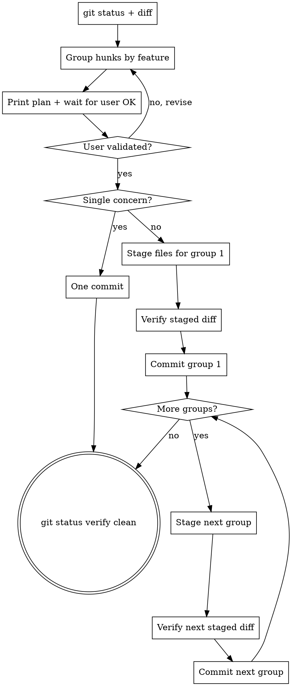

# git-commit workflow

```dot
digraph commit_flow {
    "git status + diff" [shape=box];
    "Group hunks by feature" [shape=box];
    "Single concern?" [shape=diamond];
    "One commit" [shape=box];
    "Stage files for group 1" [shape=box];
    "Verify staged diff" [shape=box];
    "Commit group 1" [shape=box];
    "More groups?" [shape=diamond];
    "Stage next group" [shape=box];
    "Verify next staged diff" [shape=box];
    "Commit next group" [shape=box];
    "git status verify clean" [shape=doublecircle];

    "git status + diff" -> "Group hunks by feature";
    "Group hunks by feature" -> "Print plan + wait for user OK";
    "Print plan + wait for user OK" [shape=box];
    "User validated?" [shape=diamond];
    "Print plan + wait for user OK" -> "User validated?";
    "User validated?" -> "Group hunks by feature" [label="no, revise"];
    "User validated?" -> "Single concern?" [label="yes"];
    "Single concern?" -> "One commit" [label="yes"];
    "One commit" -> "git status verify clean";
    "Single concern?" -> "Stage files for group 1" [label="no"];
    "Stage files for group 1" -> "Verify staged diff";
    "Verify staged diff" -> "Commit group 1";
    "Commit group 1" -> "More groups?";
    "More groups?" -> "Stage next group" [label="yes"];
    "Stage next group" -> "Verify next staged diff";
    "Verify next staged diff" -> "Commit next group";
    "Commit next group" -> "More groups?";
    "More groups?" -> "git status verify clean" [label="no"];
}
```
